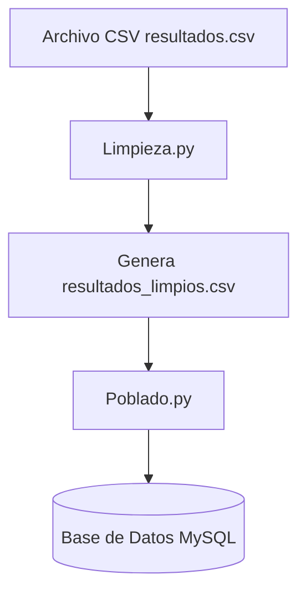

# Proyecto de Inteligencia de Negocios - Limpieza y Poblado de Datos

Este proyecto realiza dos tareas principales:

1. **Limpieza de datos**: Procesa un archivo CSV de resultados, eliminando filas vacías, duplicados y normalizando los datos.
2. **Poblado de base de datos**: Inserta los datos limpios en una tabla MySQL.

---

## 📂 Estructura del proyecto

```
Proyecto/
│── InteligenciaDeNegocios/
│   │── resultados.csv          # Archivo de datos original
│   │── Limpieza.py             # Script para limpiar el CSV
│   │── Poblado.py              # Script para poblar la base de datos MySQL
│   │── README.md               # Documentación del proyecto
```

---

## 📦 Dependencias

Antes de ejecutar los scripts, asegúrate de tener instalados los siguientes paquetes de Python:

```bash
pip install pandas mysql-connector-python
```

---

## ⚙️ Requisitos previos

1. **Python 3.12** o superior.
2. **MySQL Server** instalado y corriendo en `localhost`.
3. Una base de datos creada llamada `inteligencia_db` y una tabla con la estructura adecuada, por ejemplo:

```sql
CREATE DATABASE inteligencia_db;
USE inteligencia_db;

CREATE TABLE resultados (
    id INT AUTO_INCREMENT PRIMARY KEY,
    codigo VARCHAR(50),
    nombre VARCHAR(100),
    valor DECIMAL(10,2)
);
```

*(Ajusta los campos según la estructura real de tu CSV).*

---

## 🧹 Script de Limpieza (`Limpieza.py`)

Este script se encarga de:

* Leer el archivo `resultados.csv`.
* Eliminar duplicados y filas vacías.
* Guardar los datos limpios en un archivo `resultados_limpios.csv`.

Ejecutar con:

```bash
python Limpieza.py
```

---

## 🗄️ Script de Poblado (`Poblado.py`)

Este script se encarga de:

* Conectarse a MySQL con las credenciales configuradas.
* Leer `resultados_limpios.csv`.
* Insertar los registros en la tabla `resultados`.

Ejecutar con:

```bash
python Poblado.py
```

---

## 🔑 Configuración de credenciales

En `Poblado.py` edita las credenciales según tu configuración de MySQL:

```python
conn = mysql.connector.connect(
    host="localhost",
    user="root",
    password="TU_PASSWORD_AQUI",
    database="inteligencia_db"
)
```

---

## 🚀 Flujo de trabajo

1. Ejecutar `Limpieza.py` → genera `resultados_limpios.csv`.
2. Revisar que el archivo limpio esté correcto.
3. Ejecutar `Poblado.py` → inserta los datos en la base MySQL.
4. Consultar en MySQL para verificar:

```sql
SELECT * FROM resultados;
```

---

## 📝 Notas

* Si obtienes el error `Access denied for user 'root'@'localhost'`, revisa la contraseña de MySQL y actualízala en `Poblado.py`.
* Puedes cambiar el nombre de la base de datos o tabla según tus necesidades, pero recuerda ajustarlo en el script.

---

## 📊 Diagrama de flujo (Mermaid)



---
